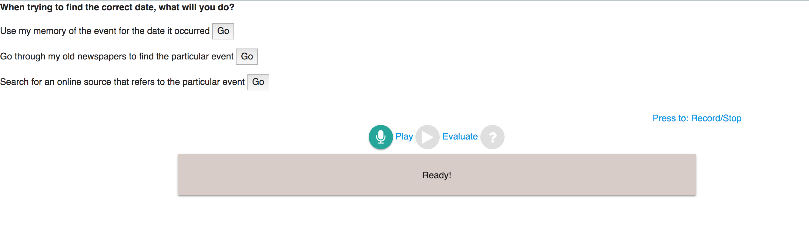

# Computer Aided Learning using Speech Recognition
### Twine Stories

Twine-Stories is a branching part scenario built to help English learners. The live demo to test out the service is at [https://snd96.pythonanywhere.com/](https://snd96.pythonanywhere.com/)

### Using Twine

The underlying base is Twee. Twee is a software used for educational purposes and to make branching games. The flexibility of Twine allows integration of HTML, CSS and JavaScript easily into the stories. This will allow the integration of the voice recorder and feedback systems directly into the story. This software is used to make tutorials based on the Accuracy Reviewal of Wikipedia using Flask. These tutorials were then converted into twee files which are basically text files which can now be used for parsing.

### Flask

Python Flask is used as the backbone for routing between different pages because it is simple to use and also reasonably fast. A single HTML page is as the main template is more or less the same for all the different twine nodes. The differences between each page will be loaded by passing the required strings to the html file using flask's render_template function.

### Speech Processing using Pocketsphinx.js

Right now not all the recordings for each phrase is available so I'm making a prototype and leaving those fields empty so that they can be filled at a later date when enough data is present. Pocketsphinx.js will be used as the speech recognizer as used in [https://cmusphinx.github.io/wiki/pocketsphinx_pronunciation_evaluation/](https://cmusphinx.github.io/wiki/pocketsphinx_pronunciation_evaluation) . This allows generally accurate recordings while in the web browser which will help in making a more robust online course for speech remediation in the future. The phrases that are being looked for in the current page are loaded into the Pocketsphinx.js recognizer. The format will be like this :

```javascript
var wordList = [["change", "CH EY N JH"], ["the", "DH AH"], ["word", "W ER D"], ["recently", "R IY S AH N T L IY"], ["to", "T UW"], ["reference", "R EH F ER AH N S"], ["date", "D EY T"], ["of", "AH V"], ["event", "IH V EH N T"], ["delete", "D IH L IY T"], ["and", "AH N D"], ["leave", "L IY V"], ["rest", "R EH S T"], ["as", "AE Z"], ["it", "IH T"], ["is", "IH Z"], ["click", "K L IH K"], ["for", "F AO R"], ["more", "M AO R"], ["pronunciation", "P R OW N AH N S IY EY SH AH N"], ["evaluation", "IH V AE L Y UW EY SH AH N"],];

var grammarChoices = {numStates: 15, start: 0, end: 14, transitions: [{from: 0, to:1, word:"change"},{from: 1, to:2, word:"the"},{from: 2, to:3, word:"word"},{from: 3, to:4, word:"recently"},{from: 4, to:5, word:"to"},{from: 5, to:6, word:"reference"},{from: 6, to:7, word:"the"},{from: 7, to:8, word:"date"},{from: 8, to:9, word:"of"},{from: 9, to:10, word:"the"},{from: 10, to:11, word:"event"},{from: 0, to:1, word:"delete"},{from: 1, to:2, word:"the"},{from: 2, to:3, word:"word"},{from: 3, to:4, word:"recently"},{from: 4, to:5, word:"and"},{from: 5, to:6, word:"leave"},{from: 6, to:7, word:"the"},{from: 7, to:8, word:"rest"},{from: 8, to:9, word:"as"},{from: 9, to:10, word:"it"},{from: 10, to:11, word:"is"},{from: 0, to:1, word:"click"},{from: 1, to:2, word:"for"},{from: 2, to:3, word:"more"},{from: 3, to:4, word:"pronunciation"},{from: 4, to:5, word:"evaluation"}]};
```

wordList will contain all the words which will be used in the recognizer like a dictionary of sorts. grammarChoices states the transition states for each word so that each the recognizer knows the order in which the words need to be recognized. For multiple choice phrases, there will be more than one word in each transition.

### Parsing the Twee files

After the twine story has been made and converted into a file which can be read by Python, there are two parser files that will be used to extract the appropriate words and phrase pronunciations from the files. The two files are parser.py and transitions.py, with the former being used to extract the questions and choices while transitions.py finds the approriate phonemes for each phrases using the cmusphinx.en.dict dictionary.

### Transitions.py

The main part about the program is a function that compiles the entire phoneme dictionary which can then be used to obtain the phonemes for a word when it is passed to the function.
```python
regexp = compile(r'\(.*\)')
CMUDICT = {}

def read_dict():
    with open('cmudict-en-us.dict',
              'r') as f:
        for line in f.readlines():
            dictline = line.strip().split()
            pronunciation = ' '.join(dictline[1:]).lower()
            if '(' in dictline[0]:
                headword = regexp.sub('', dictline[0], 1).lower()
            else:
                headword = dictline[0].lower()
            if headword in CMUDICT:
                CMUDICT[headword].append(pronunciation)
            else:
                CMUDICT[headword] = [pronunciation]

read_dict()

punct = compile(r'[,.?!]')
```
For example, if we send 'change', the returned phonemes would be CH EY N JH.

### Parser.py

The reading of the the AROWF tutorials and then extracting and sending the phrases is done using this program. Initially this program was also used to generate the entire html page from scratch based on which node the user was in currently but has been since replaced to just send the phrases to the main flask program.
The converted twine story has a unique format like
```
:: StoryTitle
AROWF 2

:: UserScript[script]


:: UserStylesheet[stylesheet]

:: Start
**You visit https://tools.wmflabs.org/arowf/answer to check on some
article to review.
This is what you see,**

[[**Change the word "recently" to reference the date of the event.** ->Step 1]]

[[ **Delete the word "recently" and leave the rest as it is.** ->End1]]

[[ **Click for more pronunciation evaluation.** ->PronEval]]

:: Step 1
When trying to find the correct date, what will you do?

[[ **Use my memory of the event for the date it occurred.** ->End 2]]

[[ **Go through my old newspapers to find the particular event.**->End 3]]

[[ **Search for an online source that refers to the particular event. **->Step 2]]

:: End1
It's better to do a more detailed edit of the article.

[[**Go back..** ->Start]]

...
```
To extract the appropriate phrases the below function is used. The node the user is currently in is passed to the function and then the required options and phrases are returned.

```Python
def make_file(node):
  with open('AROWF-recently.txt', 'r') as f:
      num_line = 0
      fname ="Start"
      #Variables used to signal the start of the parsing
      start = 0    
      #Storing the options and the next node
      next_node = [""]*3
      ccline = [""]*3
      node = ":: "+node+"\n"
      question = 0
      #For storing the question statement
      statement = ""
      for line in f.readlines():
          alpha = 0
          if(question):
              statement += line
          if(line[0] == ":" and start == 1):
            break
          if(line == node):
            start = 1
            question = 1
          elif(start!=1):
            continue
          if line[0]!='[':
              continue
          question = 0
          statement = statement[:statement.rfind('\n')]
          length = len(line)
          alpha = 0
          nodes = 0
          initial = 0
          for i in range (length):
              if (line[i] == '.'):
                  nodes = i
                  break
              if line[i].isalpha():
                  alpha = 1
              if (alpha):
                  ccline[num_line] += line[i]
          for i in range (nodes,length):
              if(line[i] == ']'):
                  break
              if(initial == 2):
                  next_node[num_line] += line[i]
              if(initial==1 and line[i].isspace()==0):
                  next_node[num_line] += line[i]
                  initial = 2
              if(line[i] == '>'):
                  initial = 1
          num_line += 1            
      return(next_node, num_line, statement, ccline)
 ```

### Node Navigation

The nodes that the user will see will be like this:



The first statement is the question that will be posed to the user. The user will then have to select one of the next 3 options to go to the next node. There are two ways that this can be done. The first one is to simply click on the 'Go'
button. The second way is to record their choice and then feed it to the Pocketsphinx.js recognizer. This can be done by pressing the record button, saying their choice and pressing the record button once again. The user can replay his voice once more to hear how he sounded. When he feels that his speech is clear enough, he can press the evaluate button which will then feed the recording to the recognizer which will return the recognized phrase. If the recognized phrase matches any of the options that are present on the page, then the button is automatically pressed, taking the user to the next page. Else the user can click record and try once more.

On a button press, a POST request is sent to the main Flask program which then generates the next file.
```html
<form action="https://snd96.pythonanywhere.com/next"  method = "POST">
                   <p>{{option1}}
                    <button name="option" id="option1" type = "submit"  value="{{next1}}">Go</button> 
                       <p>{{option2}}
                    <button name="option" id="option2" type = "submit"  value="{{next2}}">Go</button> 
                       <p>{{option3}}
                    <button name="option" id="option3" type = "submit"  value="{{next3}}">Go</button> 
                           
            </form>
```

### Intelligibility Remediation

This step requires recording of each of the phrases which has not been finished yet so it is incomplete. The one phrase for which adequate recordings has been obtained is 'we drank tea in the afternoon and watched tv'. So to specifically show the intelligibility remediation using this phrase a separate node is used which is accessed by clicking on the option 'Click for more pronunciation evaluation' in the starting page. In this page, the user can either go back to the previous page or record the phrase. However, on pressing evaluate in this page, the user's recording has more speech processing done on it so that the intelligibility score can be obtained. This intelligibility score is based on the word done in [https://github.com/brijmohan/iremedy](https://github.com/brijmohan/iremedy).
